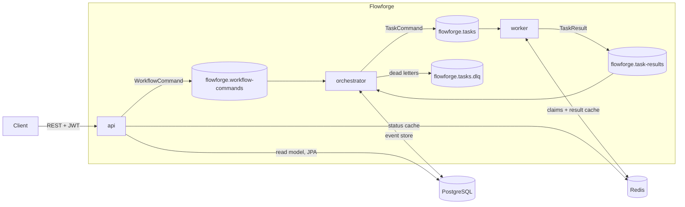

# Flowforge

[](https://github.com/VishakBaddur/Flowforge/actions/workflows/ci.yml)

An event-driven workflow orchestration platform: submit a DAG of tasks, and Flowforge runs it across a pool of workers
with dependencies, retries, exponential backoff, timeouts, worker leases, idempotent execution and dead-letter handling.
Workflow state is event-sourced in PostgreSQL, so any orchestrator can crash and another rebuilds its workflows from the log.

**Java 21 · Spring Boot 4 · Kafka · PostgreSQL · Redis · Docker · Kubernetes · Prometheus · Grafana · OpenTelemetry · GitHub Actions**

## Results (all measured, all reproducible with scripts in `loadtest/` and `scripts/`)

| What | Result |
|---|---|
| Sustained throughput | **12,456 tasks/s** over 41 s: 510,000 tasks across ~4,400 concurrent workflows, **0 lost, 0 duplicated** |
| Optimization | **14x** over the first measurement (889 tasks/s) by profiling with Prometheus, then batching Postgres writes and pipelining Redis |
| Orchestrator crash (SIGTERM) | **555 ms** failover, in-flight state rebuilt in 63 ms, 0 lost / 0 duplicated |
| Orchestrator crash (kill -9) | **6.3 s** failover (bounded by Kafka's 6 s session timeout), state rebuilt in **10 ms** |
| Worker crash (kill -9) | interrupted tasks retried on another worker in ~10.6 s, **0 stuck** |
| Redis frozen for 10 s | worst stall 1.6 s, **0 wasted retries** (circuit breaker) |
| Kubernetes rolling restart + pod deletion under load | 300/300 workflows, **0 duplicated, 0 pod restarts** |
| Tests | 39 automated (JUnit 5 + AssertJ, Testcontainers against real PostgreSQL); CI on every push |

Throughput was measured end to end (REST API → Kafka → orchestrator → Kafka → worker → Redis/Postgres) on a single
laptop, with `noop` tasks in 100-wide fan-out DAGs. Narrower DAGs batch less and run slower (22-task DAGs: ~5,600 tasks/s).

### How throughput went from 889 to 12,456 tasks/s

| Step | Change | Tasks/s |
|---|---|---|
| Baseline | one Postgres transaction per Kafka message, 3 consumer threads | 889 |
| 1 | one consumer thread per partition (12) | 1,644 |
| 2 | **batched decisions**: one transaction per Kafka poll, multi-workflow, with per-message fallback | 3,036 |
| 3 | **pipelined Redis** in the worker (claim + cache lookup for a whole batch in one round trip) | 5,615 |
| Sustained | same code, 510K tasks, wide DAGs | **12,456** |

Each step was chosen from the metrics: the orchestrator's Kafka lag and Postgres append time pointed at batching; once
orchestrator lag hit 0, worker lag pointed at Redis round trips.

## Architecture



- **Every topic is keyed by workflow id.** With the RangeAssignor, partition N of `workflow-commands` and `task-results`
  belongs to the same orchestrator instance, so each workflow has exactly one owner, processed in order.
- **PostgreSQL is the source of truth; Kafka is transport.** Events are committed before anything is published, so a
  crash between the two re-publishes on recovery. Duplicates are harmless (attempt numbers + idempotency).
- **CQRS:** the API never writes workflow state. It publishes commands (`202 Accepted`) and reads a JPA read model.

## How it works

- **DAG validation:** Kahn's algorithm; reports cycles (with the path), unknown and self dependencies all at once.
- **Event-sourced state:** `WorkflowState.apply(event)` is the only place state changes and rejects illegal transitions.
  A pure `WorkflowDecider` turns inputs (result, timer, command) into events. Both are unit-tested without I/O.
- **Optimistic concurrency:** primary key `(workflow_id, sequence)`; a losing writer rolls back and retries.
- **Retries:** exponential backoff with full jitter, capped. Exhausted retries go to the DLQ and downstream tasks are skipped.
- **Leases and timeouts:** a worker reports STARTED with a lease; the orchestrator retries the task if the lease expires.
- **Idempotency, three layers:** attempt numbers (stale or duplicate results are ignored), a Redis result cache keyed by
  `workflowId:taskId` (a completed task is never re-executed), and a two-phase Redis claim (one worker per attempt).
- **Crash recovery:** on partition assignment, the new owner loads all RUNNING workflows for those partitions in one
  query, replays their events, re-publishes queued tasks and re-arms timers.
- **Graceful degradation:** Redis is an optimization; a circuit breaker with safe fallbacks keeps work flowing without it.

## Bugs found by testing, not by luck

| Found by | Bug | Fix |
|---|---|---|
| worker kill test | a task could stick in QUEUED forever: the dead worker's 7 s claim outlived Kafka's 6 s redelivery | two-phase claim: 3 s pending TTL, atomic Lua extend after STARTED is durable |
| Redis outage test | an optional cache write blocked result reporting; 196 needless retries | 500 ms timeouts + circuit breaker; cache failures can't fail a task |
| `timer_early` metric | `toMillis()` truncation made retry timers spin in a 0 ms reschedule loop | round delays up |
| failover timing | graceful failover took 1.7 s: survivors only learn of a rebalance on their next heartbeat | heartbeat 2 s → 500 ms (262 ms failover) |
| Kubernetes rollout | `too many clients`: (replicas + surge) x pool size exceeded Postgres `max_connections` | connection budget per Deployment |
| Kubernetes demo | resource starvation → CoreDNS crash → DNS failures → 1 s liveness probes killing slow pods | `hostAliases`, probe timeouts, memory sizing |

## Observability

- **Prometheus metrics** (workflow and task throughput; dispatch, turnaround, Postgres append and workflow-duration
  histograms; ignored inputs by kind; recovery time; worker in-flight, cache replays, Redis breaker state).
- **Grafana dashboard as code** (`infra/grafana/build_dashboard.py`, 16 panels, provisioned automatically).
- **OpenTelemetry tracing** (Spring Boot 4 starter → Jaeger). Batch Kafka listeners don't propagate context automatically,
  so `KafkaTraceContext` injects and extracts W3C `traceparent` per record: one trace follows a workflow across the API,
  orchestrator and workers, including fan-out. Parent-based 10% sampling.

## Running it

Prerequisites: Java 21, Maven, Docker. Ports used on the host: 8080 (API), 9092/9094 (Kafka), 5433 (Postgres),
6380 (Redis), 9090 (Prometheus), 3000 (Grafana), 16686 (Jaeger), 8090 (Kafka UI).

```bash
# Everything in containers
mvn -DskipTests package
docker compose -f infra/docker-compose.yml --profile app up -d --build --scale worker=2

# Get a token and submit a workflow
TOKEN=$(curl -s -X POST localhost:8080/api/v1/auth/token -H 'Content-Type: application/json' \
  -d '{"username":"alice","password":"alice-pass"}' | python3 -c 'import sys,json; print(json.load(sys.stdin)["accessToken"])')
curl -s -X POST localhost:8080/api/v1/workflows -H "Authorization: Bearer $TOKEN" \
  -H 'Content-Type: application/json' -d @examples/diamond.json
```

Dashboards: Grafana http://localhost:3000/d/flowforge (admin/admin) · Jaeger http://localhost:16686 · Kafka UI http://localhost:8090

**Local development** (services as JVMs, infrastructure in Docker): `docker compose -f infra/docker-compose.yml up -d --wait`,
then `mvn -DskipTests install && ./scripts/dev-up.sh`.

**Kubernetes** (kind): `kind create cluster --config k8s/kind-config.yaml`, `kind load docker-image flowforge/api:dev
flowforge/orchestrator:dev flowforge/worker:dev --name flowforge`, `kubectl apply -k k8s/`. The API is at
http://localhost:8085. Stateful services stay outside the cluster, as managed services (RDS, MSK, ElastiCache) would.

**Tests and experiments:** `mvn verify` · `python3 loadtest/load_test.py --workflows 5000 --width 100 --label run`
· `./scripts/reliability-suite.sh` · `./scripts/k8s-demo.sh`

## API

| Method | Path | Scope |
|---|---|---|
| POST | `/api/v1/auth/token` | dev token issuer |
| POST | `/api/v1/workflows` (optional `Idempotency-Key` header) | `workflows:write` |
| GET | `/api/v1/workflows/{id}`, `/api/v1/workflows?status=`, `/api/v1/workflows/{id}/events` | `workflows:read` |
| POST | `/api/v1/workflows/{id}/cancel` | `workflows:write` |

Users see only their own workflows (others get 404); `workflows:admin` sees all. Errors are RFC 9457 problem details.

## Limitations and next steps

- Benchmarks ran on one laptop (everything sharing 12 cores); a real deployment would separate the brokers and database.
- Tracing costs roughly 15–20% throughput (per-message context propagation), independent of sampling rate.
- Workers interrupt in-flight tasks on SIGTERM (they're retried, not lost); draining them during the grace period is next.
- CPU is the wrong autoscaling signal for I/O-bound workers (44% CPU while keeping up); scale on Kafka consumer lag (KEDA).
- Hard-crash failover is bounded by Kafka's session timeout (6 s minimum on the broker).
- Dev-only credentials (token issuer, Kubernetes Secret) are committed for local use; production would use an external
  identity provider and a secret manager.
