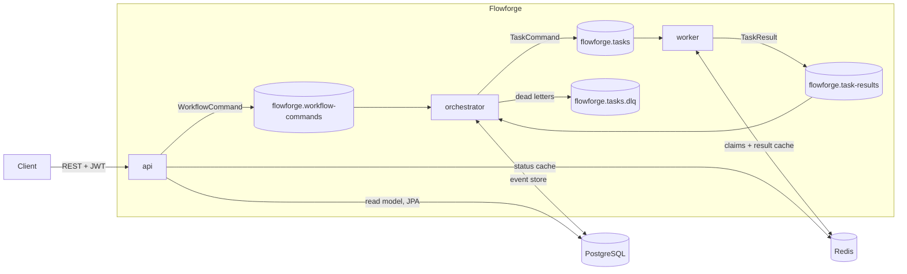
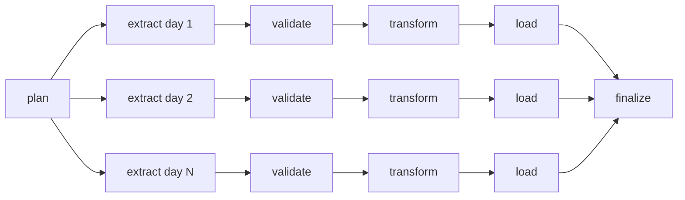

# Flowforge

[](https://github.com/VishakBaddur/Flowforge/actions/workflows/ci.yml)

Flowforge is an event-driven workflow orchestration platform. You submit a DAG of tasks and it runs them across a pool
of workers with dependencies, retries, exponential backoff, timeouts, worker leases, idempotent execution and
dead-letter handling. Workflow state is event-sourced in PostgreSQL, so if an orchestrator crashes, another instance
rebuilds its workflows from the log and continues.

It also runs a production-style ETL workload over NYC 311 data (about 324,000 rows a month) with data-quality
gates, idempotent loads, a watermark and parallel backfills. See [ETL workload](#etl-workload-nyc-311-service-requests).

Built with Java 21, Spring Boot 4, Kafka, PostgreSQL, Redis, Docker, Kubernetes, Prometheus, Grafana, OpenTelemetry
and GitHub Actions.

## Results

All numbers below come from scripts in `loadtest/` and `scripts/` and can be reproduced.

| Measurement | Result |
|---|---|
| Sustained throughput | 10,066 tasks/s over 50.7 s (510,000 tasks, about 4,400 concurrent workflows, tracing on), 0 lost, 0 duplicated |
| Optimization | 6.3x from code changes on the same 22-task workload (889 to 5,615 tasks/s); 100-wide DAGs then reached 12,456 tasks/s before tracing and 10,066 after |
| Orchestrator stopped with SIGTERM | 555 ms failover, in-flight state rebuilt in 63 ms, 0 lost or duplicated |
| Orchestrator killed with kill -9 | 6.3 s failover (Kafka's 6 s session timeout), state rebuilt in 10 ms |
| Worker killed with kill -9 | interrupted tasks retried on another worker within about 10.6 s, 0 stuck |
| Redis frozen for 10 s | longest stall 1.6 s, 0 extra retries |
| Kubernetes rolling restart and pod deletion under load | 300/300 workflows completed, 0 duplicated, 0 pod restarts |
| Tests | 39 automated tests (JUnit 5, AssertJ, Testcontainers with PostgreSQL), run in CI on every push |

Across the reliability suite: 0 lost and 0 duplicated tasks.

Throughput was measured end to end (REST API, Kafka, orchestrator, Kafka, worker, Redis and PostgreSQL) on a single
laptop, using `noop` tasks in DAGs with 100 parallel tasks. Narrower DAGs batch less and run slower; 22-task DAGs
reached about 5,600 tasks/s.

### Throughput history

| Step | Change | Tasks/s |
|---|---|---|
| Baseline | one PostgreSQL transaction per Kafka message, 3 consumer threads | 889 |
| 1 | one consumer thread per partition (12) | 1,644 |
| 2 | batched decisions: one transaction per Kafka poll, with a per-message fallback | 3,036 |
| 3 | pipelined Redis calls in the worker (claim and cache lookup for a whole batch in one round trip) | 5,615 |
| Sustained run | same code, 510K tasks, wide DAGs | 12,456 |
| Final architecture | same workload with tracing at 10% sampling and per-task keying | 10,066 |

Each change came from the metrics. Orchestrator Kafka lag and PostgreSQL append time pointed to batching. Once
orchestrator lag reached zero, worker lag pointed to Redis round trips.

## Architecture



- `workflow-commands` and `task-results` are keyed by workflow id. With the RangeAssignor, partition N of both topics
  goes to the same orchestrator instance, so each workflow has exactly one owner and its messages are processed in order.
  The `tasks` topic is keyed by workflow and task id, so a single large workflow spreads across every worker.
- PostgreSQL is the source of truth and Kafka is the transport. Events are committed before anything is published, so
  a crash between the two leads to a re-publish during recovery. Duplicates are harmless because of attempt numbers
  and idempotency checks.
- The API never writes workflow state. It publishes commands, returns `202 Accepted`, and reads from a JPA read model.

## How it works

- DAG validation uses Kahn's algorithm and reports cycles (with the path), unknown dependencies and self-dependencies
  in one response.
- `WorkflowState.apply(event)` is the only place workflow state changes, and it rejects illegal transitions. A pure
  `WorkflowDecider` turns inputs (task results, timers, commands) into events. Both are unit tested without any I/O.
- Optimistic concurrency: the primary key `(workflow_id, sequence)` rejects a conflicting writer, which rolls back
  and retries.
- Retries use exponential backoff with full jitter and a cap. When retries run out, the task goes to the dead-letter
  topic and its downstream tasks are skipped.
- A worker reports STARTED with a lease, and the orchestrator retries the task if the lease expires.
- Idempotency works in three layers: attempt numbers (stale or duplicate results are ignored), a Redis result cache
  keyed by `workflowId:taskId` (a completed task is never run again), and a two-phase Redis claim (one worker per attempt).
- On partition assignment, the new owner loads all running workflows for those partitions in one query, replays their
  events, re-publishes queued tasks and re-arms timers.
- Redis is treated as an optimization. A circuit breaker with safe fallbacks keeps work moving when Redis is down.

## Bugs found by testing

| Found by | Problem | Fix |
|---|---|---|
| Worker kill test | A task could stay QUEUED forever because the dead worker's 7 s claim outlived Kafka's 6 s redelivery | Two-phase claim: 3 s pending TTL, then an atomic Lua extend once STARTED is durable |
| Code review | The phase-2 claim extension's result was ignored, so a worker could run an attempt that another worker had claimed | The result is checked: an expired, unclaimed key is re-taken and a task claimed by another worker is skipped; the worker refuses to start unless the claim TTL is below Kafka's session timeout |
| Redis outage test | An optional cache write blocked result reporting, causing 196 unnecessary retries | 500 ms timeouts and a circuit breaker; cache failures can no longer fail a task |
| `timer_early` metric | Millisecond truncation made retry timers reschedule themselves in a 0 ms loop | Round delays up |
| Failover timing | Graceful failover took 1.7 s because the surviving instance only learned of the rebalance on its next heartbeat | Heartbeat lowered from 2 s to 500 ms (262 ms failover in the run right after the fix; 555 ms in the later reliability-suite run) |
| Kubernetes rollout | `too many clients`: (replicas + surge) x pool size exceeded PostgreSQL `max_connections` | Connection budget per Deployment |
| Kubernetes demo | Resource starvation crashed CoreDNS, causing DNS failures, and 1 s liveness probes then killed slow pods | `hostAliases`, longer probe timeouts, memory sizing |
| CI image scan | 7 critical CVEs in Netty and Tomcat | Spring Boot 4.0.6 to 4.0.8, Tomcat 11.0.25 override |
| ETL incremental run | The watermark advanced past a day the source had only partly published (1,114 of about 11,000 rows) | Volume check against the trailing 14-day median, plus a 2-day publication lag for incremental runs |
| ETL worker kill test | All tasks of one workflow shared a Kafka key, so a 122-task backfill ran on a single worker | Tasks keyed by workflow and task id; orchestrator topics stay keyed by workflow id |

## ETL workload: NYC 311 service requests

Flowforge also runs an ETL pipeline over NYC's public 311 service request data (about 10,000 records a day). Each run
is one Flowforge workflow: one chain per day, all days in parallel, and a final step that only runs after every day
has loaded.



- Extract pages one day from the NYC Open Data API and stores the raw JSON in `raw.service_requests`. It is retried
  up to 5 times.
- Validate checks row counts, required columns, null thresholds, duplicates, and the day's volume against the trailing
  14-day median, in one SQL pass. A failed check fails the task with no retries, sends it to the dead-letter topic,
  and skips that day's downstream tasks.
- Transform converts NYC local time to UTC timestamps, normalizes text, borough, zip code and coordinates, nulls
  impossible close dates, keeps the latest version of each request, and records rejected rows with a reason.
- Load upserts the date, agency, complaint type and location dimensions in sorted key order, then upserts the fact
  table by natural key, where the newer source version wins.
- Finalize confirms every day loaded, rebuilds the daily aggregate, computes a checksum of the loaded facts, writes a
  run report, and advances the watermark.

Retries are set per stage: extract 5 (network), transform 2, load 3 (lock conflicts) and finalize 3. Validate has
none, because a failed data check is deterministic and retrying bad data does not fix it. One consequence: a
transient database error during validation also goes straight to the dead-letter topic. Classifying errors as
retryable or not, rather than configuring retries per stage, would be the cleaner design.

Every stage deletes and rewrites only its own (run, day) partition in one transaction, so a retried task never
duplicates data. Data moves between stages through PostgreSQL tables (`raw`, `staging`, `analytics`) in a separate
`analytics` database; Flowforge passes only small task outputs between tasks.

The watermark ("data complete through") is advanced only by finalize, only forward, and only when the run is
contiguous with what is already complete. If any day fails, finalize does not run and the watermark stays where it was.

### ETL results

| Measurement | Result |
|---|---|
| September 2026 backfill | 323,614 rows, 30 partitions, 122 tasks in 28.6 s (about 11,300 rows/s); the stages' combined busy time was about 490 s |
| Accuracy | warehouse row count matched the API's count and the distinct natural-key count (323,614) |
| Re-running the same backfill | 0 inserted, 0 updated, 323,614 unchanged, identical fact checksum |
| Worker killed mid-backfill | 16 tasks retried after lease expiry; 0 inserted, identical checksum |
| Simulated source update (100 records) | exactly 100 rows updated; the checksum returned to its original value |
| Upstream schema change (injected on one day) | caught by the required-column check and dead-lettered; the other days loaded; watermark held |
| Partially published day (1,114 rows against a median of 11,070) | caught by the volume check; watermark held |
| Cleaning (September and early October) | 211 impossible close dates nulled, 432 unknown boroughs, 3,270 missing or invalid zip codes, 6,306 missing or out-of-range coordinates |
| Docker Compose (2 worker containers) | 30,892 rows over 3 days; tasks split 7 and 7 across the containers |
| Kubernetes (kind) | 31,574 rows over 3 days in 15.8 s; 0 pod restarts |

Extraction dominates run time (about 12.8 s per day waiting on the NYC API, against 0.2 s to validate, 0.7 s to
transform and 2.7 s to load), so a 2-day incremental run takes about as long as a 30-day backfill. Incremental runs
save work and load on the source, not wall-clock time.

```bash
python3 etl/pipeline.py backfill --start 2026-09-01 --end 2026-09-30
python3 etl/pipeline.py incremental     # watermark minus a 2-day lookback, up to today minus a 2-day publication lag
python3 etl/pipeline.py backfill --start 2026-09-01 --end 2026-09-07 --inject-fault 2026-09-04
```

## Observability

- Prometheus metrics for workflow and task throughput; dispatch, turnaround, PostgreSQL append and workflow-duration
  histograms; ignored inputs by kind; recovery time; and worker in-flight tasks, cache replays and Redis breaker state.
- A Grafana dashboard defined in code (`infra/grafana/build_dashboard.py`, 16 panels, provisioned automatically).
- OpenTelemetry tracing with the Spring Boot 4 starter and Jaeger. Spring Kafka does not propagate trace context for
  batch listeners, so `KafkaTraceContext` injects and extracts the W3C `traceparent` header for each record. A single
  trace follows a workflow across the API, orchestrator and workers, including fan-out. Sampling is parent-based at 10%.

## Running it

Prerequisites: Java 21, Maven and Docker. Host ports used: 8080 (API), 9092 and 9094 (Kafka), 5433 (PostgreSQL),
6380 (Redis), 9090 (Prometheus), 3000 (Grafana), 16686 (Jaeger), 8090 (Kafka UI).

```bash
# Everything in containers
mvn -DskipTests package
docker compose -f infra/docker-compose.yml --profile app up -d --build --scale worker=2

# Get a token and submit a workflow
TOKEN=$(curl -s -X POST localhost:8080/api/v1/auth/token -H 'Content-Type: application/json' \
  -d '{"username":"alice","password":"alice-pass"}' | python3 -c 'import sys,json; print(json.load(sys.stdin)["accessToken"])')
curl -s -X POST localhost:8080/api/v1/workflows -H "Authorization: Bearer $TOKEN" \
  -H 'Content-Type: application/json' -d @examples/diamond.json
```

Once it is running locally: Grafana at `localhost:3000/d/flowforge` (admin/admin), Jaeger at `localhost:16686`,
Kafka UI at `localhost:8090`.

Local development, with the services as JVMs and the infrastructure in Docker:

```bash
docker compose -f infra/docker-compose.yml up -d --wait
mvn -DskipTests install && ./scripts/dev-up.sh
```

Kubernetes with kind:

```bash
kind create cluster --config k8s/kind-config.yaml
kind load docker-image flowforge/api:dev flowforge/orchestrator:dev flowforge/worker:dev --name flowforge
kubectl apply -k k8s/
```

The API is then at `localhost:8085`. Kafka, PostgreSQL and Redis stay outside the cluster, the way managed services
(RDS, MSK, ElastiCache) would.

Tests and experiments:

```bash
mvn verify
python3 loadtest/load_test.py --workflows 5000 --width 100 --label run
./scripts/reliability-suite.sh
./scripts/k8s-demo.sh
```

## API

| Method | Path | Scope |
|---|---|---|
| POST | `/api/v1/auth/token` | development token issuer |
| POST | `/api/v1/workflows` (optional `Idempotency-Key` header) | `workflows:write` |
| GET | `/api/v1/workflows/{id}`, `/api/v1/workflows?status=`, `/api/v1/workflows/{id}/events` | `workflows:read` |
| POST | `/api/v1/workflows/{id}/cancel` | `workflows:write` |

Users only see their own workflows; requests for anyone else's return 404. The `workflows:admin` scope sees all of them.
Errors are returned as RFC 9457 problem details.

## Limitations and next steps

- Benchmarks ran on one laptop with every component sharing 12 cores. A real deployment would put the brokers and
  database on separate machines.
- Tracing costs throughput because of per-message context propagation, regardless of the sampling rate: the same
  510K-task benchmark ran at 12,456 tasks/s before tracing and 10,066 tasks/s after (about 19% on a CPU-saturated laptop).
- Workers interrupt in-flight tasks on SIGTERM. Those tasks are retried, not lost, but draining them during the
  shutdown grace period would avoid the retries.
- CPU is the wrong autoscaling signal for I/O-bound workers (a worker kept up at 44% CPU). Scaling on Kafka consumer
  lag, for example with KEDA, would fit better.
- Hard-crash failover is bounded by Kafka's session timeout (6 s minimum on the broker).
- Development credentials (the token issuer and the Kubernetes Secret) are committed for local use. Production would
  use an external identity provider and a secret manager.
- Flowforge DAGs are fixed when submitted, so the ETL runner generates the backfill partitions up front rather
  than at run time.
- Retries are configured per task type, not per error type (see the ETL section).
